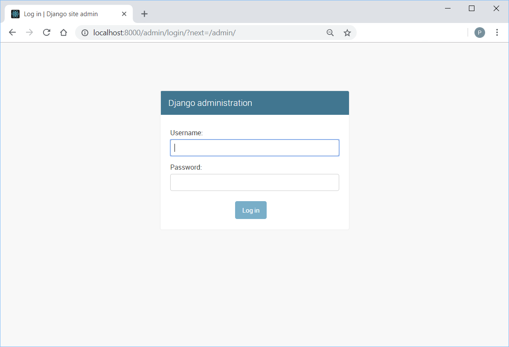

## production-like Django, Celery and React app
Repository contains sample Django, Celery and React setup with docker compose, which can be used to easily start a new project and tune its production environment settings.


### Django
Django application serving articles and comments data. It uses [rest-framework](https://www.django-rest-framework.org/) to create RESTful API and [pytest-django](https://pytest-django.readthedocs.io/en/latest/) as its test runner. Data is produced by periodic tasks using [faker](https://faker.readthedocs.io/en/latest/index.html) library to create fake Articles and Comments. Django Admin panel is added by default and is available under `/admin/` URL.

<p align="center">
 
</p>

Static files for Django Admin panel are collected when the image is build. Application in  production environment runs with uWSGI - 2 processes and 2 threads each. Environment is configured by variables stored in `config/local.env` file (see [django-environ](https://django-environ.readthedocs.io/en/latest/) and [12factor](https://www.12factor.net/)). API URLs to fetch Articles and Comments are respectively `/api/main/article/` and `/api/main/comment/`.

Run `pytest` in `backend/` directory to start test session.
```
============================= test session starts ==============================
platform linux -- Python 3.6.3, pytest-3.6.3, py-1.7.0, pluggy-0.6.0
Django settings: config.settings.test (from ini file)
rootdir: /django-react-docker/backend, inifile: pytest.ini
plugins: django-3.4.4, codestyle-1.2.2
collected 29 items                                                             

main/tests/article/test_api.py ........                                  [ 27%]
main/tests/article/test_model.py ........                                [ 55%]
main/tests/comment/test_api.py .......                                   [ 79%]
main/tests/comment/test_model.py ......                                  [100%]
========================== 29 passed in 1.71 seconds ===========================
```


### Celery
Built on top of `backend_image` (Django), uses source code and installed dependencies to execute periodic tasks. Celery service runs 3 processes with [supervisor](http://supervisord.org/) when container starts
- Celery Beat - schedules periodic tasks and puts them on `celerybeat_periodic` queue
- Celery Worker - consumes tasks from `celerybeat_periodic` queue and executes code
- Celery Flower - runs [Flower](https://flower.readthedocs.io/en/latest/) application used to monitor tasks executed by Celery Worker, available
under `/flower/` URL

<p align="center">
 
</p>


### React
Set up with [create-react-app](https://github.com/facebook/create-react-app) starter project, consists of few React components for rendering articles and comments data fetched from backend API. Every 20 seconds new request is send and components' states are updated with new data. Application available under root `/` URL.

<p align="center">
 
</p>


Source code and static files are bundled when the Docker image is build. Run `npm test` in `web/` directory to start test session.
```
 PASS  src/App.test.js
 PASS  src/components/Comment/Comment.spec.js
 PASS  src/components/Article/Article.spec.js
 PASS  src/components/ArticleList/ArticleList.spec.js
 PASS  src/components/CommentList/CommentList.spec.js
 PASS  src/utils/ArticleAdapter.spec.js

Test Suites: 6 passed, 6 total
Tests:       17 passed, 17 total
Snapshots:   0 total
Time:        5.578s
Ran all test suites.
```

### Database
Built on top of `postgres:10-alpine` image, uses env configuration
```
ENV POSTGRES_USER postgres
ENV POSTGRES_PASSWORD postgres
ENV POSTGRES_DB web_app_database
```
to create `web_app_database` database and `postgres` role when the image is build. It allows to modify `postgresql.conf` and `pg_hba.conf` configuration from repository level. `init.sql` script can be used to initialize databases, roles, users etc. 


### RabbitMQ
RabbitMQ is used to queue periodic task scheduled by Celery Beat process. Tasks from `celerybeat_periodic` queue are consumed by Celery Worker process. Image `rabbitmq:3.6-management-alpine` provides service with enabled management panel, which is available under `/rabbitmq/` URL. Default credentials are username: `guest` and password: `guest`.

<p align="center">
 
</p>


RabbitMQ can be used as a message broker for all services.


### Nginx
Handles website traffic and processess incoming requests depending on destination URL.
- `/api/` and `/admin/` requests are passed (`uwsgi_pass`) to backend application
- `/rabbitmq/` request is passed to RabbitMQ management panel service listening on port `15672`
- `/flower` request is passed to Celery Frower process listening on port `5555` inside Celery
- static files are served from `/var/www/` directory

Static files are copied from `backend_image` (Django) and `web_image` (React) when the image is build. Contains boilerplate to easily set up HTTPS connection.

### Running
All you need to run this project is installed `docker-compose` service (see [docs](https://docs.docker.com/compose/)).
```
$ git clone https://github.com/zyks/django-react-docker.git
$ cd django-react-docker/
$ docker-compose up
```
 
### Troubleshooting
When Celery Beat process refuses to start (usually returns `exit code 73`) try to remove its `.pid` file from `backend/` directory. 
```
$ rm -f backend/celerybeat.pid
```
Source code directory is mounted with a volume by default and the `.pid` file stays in repository when the process exits unexpectedly. You could also try to rebuild Celery image `docker-compose build celery` - it removes the `celerybeat.pid` in its `Dockerfile`.
